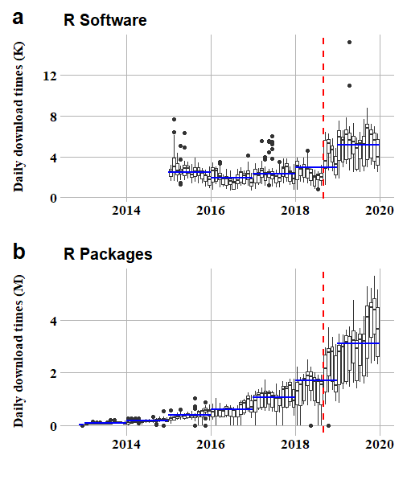
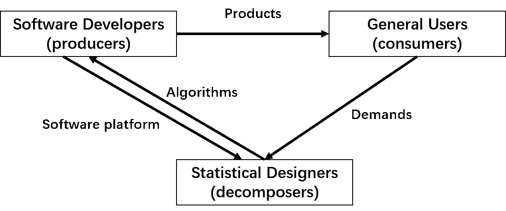
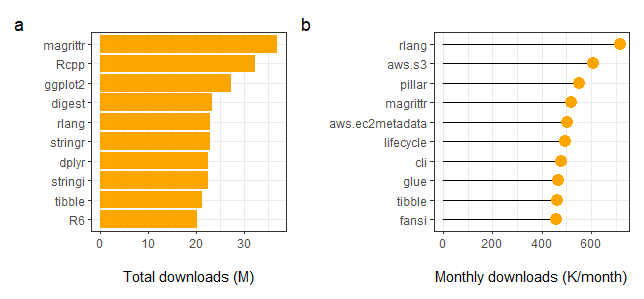
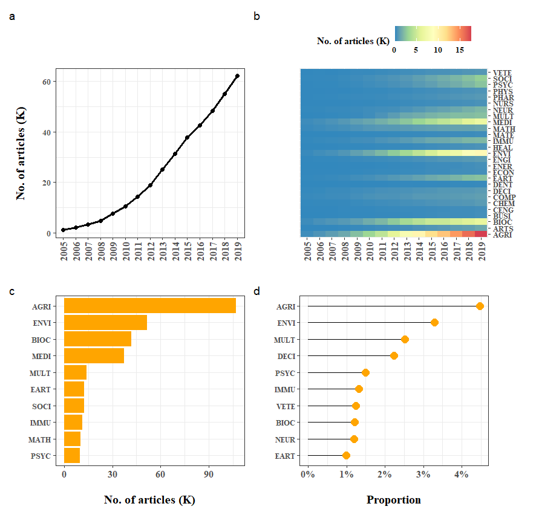
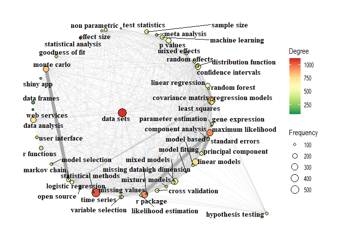
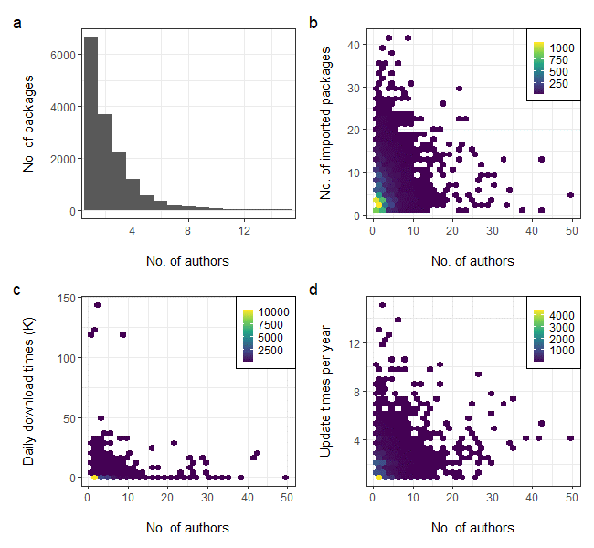
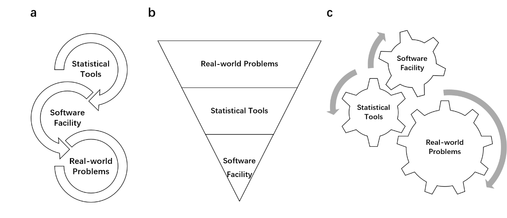

```{r setup, include=FALSE}
knitr::opts_chunk$set(echo = FALSE, warning = FALSE, message = FALSE)
```

# Introduction

Among the various programming languages, R is famous for its capability in data mining. Yet, the TIOBE Index for programming languages has found a decreasing trend in the use of R from 2018 to 2019 (<https://www.tiobe.com/tiobe-index/r/>). While few people dig into the details of how this index is calculated, this popular index did bring panic and depressed some R users and developers, even those who had been using R for years. But according to the download logs of CRAN (the Comprehensive R Archive Network), neither R software nor R packages are facing a reduction in the downloads during this period (Figure \@ref(fig:fig1)). On the contrary, there was a remarkable leap in the latter half of 2018. The data shows that August 2018 was the tipping point for the number of downloads (at monthly level), both for R software and R packages. There is no doubt that R has been used by more people and more frequently over time.

As a programming language, R's free open-source environment was derived from the S language, developed at Bell Labs during the seventies. The R core was first launched in 1997 and is maintained by the R Core Team and R Foundation since then. The public management of R packages is mainly supported by CRAN, while other major repositories include BioConductor, R-Forge, and GitHub [@GermanAdams-562; @PlakidasSchall-561]. While these repositories have overlapping packages, CRAN remains the center of the R package management system [@DecanMens-557]. The usage of R is extensive and gradually R has become one of the most popular softwares in scientific research. This has led scientists to pay more attention to the scientific usage of R packages. Related investigations focus on the co-mentioning network of R packages [@LiYan-560] and citation patterns of specific or general R packages [@LiChen-558; @LiYan-559]. In addition, numerous studies have shown that researchers and practitioners from various backgrounds embrace R for its openness and reproducibility [@GentlemanCarey-499; @PebesmaNst-498; @HuberCarey-496; @LowndesBest-495; @KayaAgca-491; @LaiLortie-492], though creating and maintaining software itself is not generally recognized as an academic accomplishment [@YangRousseau].

In this paper, we would like to suggest a new framework for the R ecosystem and provide an empirical review of it based on the metadata from CRAN (<https://cran.r-project.org/>) and Scopus, the well-known database provided by Elsevier (<https://www.scopus.com/>). The concept of a software ecosystem was first suggested around 2000 [@MesserschmittSzyperski-609], and developed rapidly in the following years [@IansitiLevien-615; @Hanssen-614; @ManikasHansen-611; @Jansen-613]. By drawing upon the well-established concept of an "ecosystem" in ecology, this approach tries to classify members into different components, investigate their characteristics, and study their interactions. In this way community members from possibly segregated sections benefit by seeing how they are part of the whole. Extending this concept to the open-source software community, research on open source ecosystems has been carried out for various programming languages, including Ruby [@KabbedijkJansen-623; @SyeedHansen-624], Python [@HovingSlot-617], and R [@GermanAdams-562; @PlakidasSchall-561; @DecanMens-557].

Previous studies suggest that the R ecosystem consists of three main areas, namely the R platform, the software marketplace(s), and the community [@PlakidasSchall-561]. Inspired by this framework, we provide some adjustments and extensions to make the software ecosystem more similar to a biological ecosystem. The proposed framework for the R ecosystem is displayed in Figure \@ref(fig:fig2). Software developers act as producers of the ecosystem, they build tools and provide products (e.g., R packages) for the users (considered as consumers). General users have various demands for the statistical designers (considered as decomposers) according to their tasks. Then, the statistical designers propose multiple algorithms to meet the needs of the users, and the required algorithms are then transferred to the software developers to make better products. In addition, the developers must provide a software platform for the statistical designers, so that they can test their ideas and schemes. While these three groups of members may overlap, abstracting these roles helps us understand different driving models of the development of the R ecosystem. Based on this framework, we explore four specific questions from different perspectives.

1.  From the perspective of software developers: what are the most popular R packages over the late 15 years since 2005 and why?
2.  From the perspective of academic users: which fields do they come from and why are they using R?
3.  From the perspective of statistical designers: what motivate them to develop R packages?
4.  From the perspective of the global R community: How do they collaborate and to what extent?

By exploring these questions and making critical discussions, we intend to gain a better understanding of the current R ecosystem and shape the future development of R.

```{r fig1, out.width = "80%", out.height = "50%", fig.cap = "The daily downloads of R software (a) and R packages (b). The boxplots show the daily number of downloads in a month. The blue lines show the average daily download in each year, and the dashed red line indicates where the number of downloads shows a sudden change (yielded by changepoint package). Source of data: http://cran-logs.rstudio.com/. "}

```

```{r fig2, out.width = "100%", out.height = "30%", fig.cap = "Framework of the R ecosystem in our study. This resembles the biological ecosystem which consists of three main roles, namely producers, consumers, and decomposers. "}

```

# Data and software

To get a comprehensive view of the R ecosystem, multiple data sources are collected and utilized, namely (1) Download information of R and R packages. These download logs were accessed from Rstudio CRAN Mirror (<http://cran-logs.rstudio.com/>), and information on the daily number of downloads was retrieved via APIs from \CRANpkg{cranlogs} package; (2) Metadata of R packages on CRAN. The metadata of R packages, such as their authors, maintainers, published date and imported packages (dependent packages),are archived in CRAN. These data were extracted using \CRANpkg{RWsearch} package. The target data in our research was retrieved on January 1st, 2020; (3) Bibliometric data of papers citing R: The bibliometric data could helped us to explore how R is utilized in academia. Referring to the previous research [@LiYan-559], our study retrieved the bibliometric data of papers citing R software from Scopus using advanced search (the advanced query was "REF ({R: A Language and Environment for Statistical Computing} OR {<http://www.r-project.org>}) AND DOCTYPE (ar)"), yielding 364,928 articles published from 2005 to 2019. The \CRANpkg{rscopus} package was used to facilitate the acquisition of bibliometric data from Scopus. The bibliometric data contains information of publication year, title, keywords, journal title, ISSN, etc. Scopus Subject Area categories were used to classify the publications into different subjects. The data analyses were carried out in R software. The R packages used in the study include \CRANpkg{tidyverse}, \CRANpkg{data.table}, \CRANpkg{patchwork}, \CRANpkg{changepoint}, \CRANpkg{lubridate}, \CRANpkg{fst}, \CRANpkg{akc}, \CRANpkg{graphlayouts} and \CRANpkg{tidyfst}.

# Method and results

## Popular R packages

Examining the most downloaded R packages in total on CRAN between 2005 and 2019, we found that the top 10 R packages (Figure \@ref(fig:fig3)a) have a share of about 10% of the total downloads. These packages provide essential functionalities for further development in the R ecosystem. Among them, \CRANpkg{ggplot2}, \CRANpkg{stringr} (a wrapper of \CRANpkg{stringi}), \CRANpkg{dplyr} might be the best known to end-users because they are completely data-oriented and easy to use with consistent and readable APIs. Furthermore, packages like \CRANpkg{Rcpp}, \CRANpkg{digest}, \CRANpkg{rlang} and \CRANpkg{R6} brought great convenience to R programmers (especially software developers), and thus are often imported by other packages during R development. Especially, \CRANpkg{magrittr} and \CRANpkg{tibble}, add fundamental functionalities to other packages. Simply representing "and then" in natural language, the operator `%>%` in \CRANpkg{magrittr} is elementary for R as a language. This implementation is in line with the logic of human thinking. It reduces development time and improves the readability and maintainability of R code. As the pipe syntax has gained recognition and acceptance, on May 18, 2021, a native pipe (`|>`) was introduced in the released R version 4.1.0. Moreover, considering R as an environment, "data frame" is an important data structure (a two-dimension table with rows and columns), and \CRANpkg{tibble} has offered an enhanced class (named 'tibble' or 'tbl_df') for it. This redesigned class provides end-users the means to inspect the traditional data frame fast and safely. Therefore, it is adopted by many other R packages and widely used in data science workflows, especially for big data analysis.

Turning to the list of monthly downloads (Figure \@ref(fig:fig3)b), we see more packages designed for R developers are releasing, including \CRANpkg{pillar}, \CRANpkg{lifecycle}, \CRANpkg{cli} and \CRANpkg{fansi}. As a complementary component to string operation, \CRANpkg{glue} is also gaining popularity and becomes the main package imported in other utilities (including \CRANpkg{stringr}). Finally, as part of the "cloudyr" project (<https://cloudyr.github.io/>), the rise of the \CRANpkg{aws.s3} and the \CRANpkg{aws.ec2metadata} package has revealed another trend, namely using and developing R in a cloud computing platform. To conclude, the popularity of modern R mainly depends on software facilities provided by the R environment, which greatly improves the reliability and efficiency of data science workflows.

```{r fig3, out.width = "100%", out.height = "30%", fig.cap = "Top 10 R packages (a) by total downloads and (b) by monthly downloads from 2005 to 2019 since publication. "}

```

## Applications of R in academia

According to Scopus, the number of academic articles citing R software has been steadily increasing from 2005 to 2019 (Figure \@ref(fig:fig4)a). While only 1057 citations were tracked in 2005, the number of articles citing the R software has reached a total of 62,168 citations in 2019. Considering the subject area of these articles, we found a remarkable upward trend of R usage in "Agricultural and Biological Sciences", "Biochemistry, Genetics, and Molecular Biology", "Earth and Planetary Sciences", "Environmental Science", "Immunology and Microbiology", "Medicine", "Psychology" and "Social Sciences" (Figure \@ref(fig:fig4)b). This is probably due to the flourishing of measurement methods and data sciences in these scientific fields. During this period of 15 years "Agricultural and Biological Sciences" and "Environmental Science" turned out to be the most active subject areas using R (Figure \@ref(fig:fig4)c and Figure \@ref(fig:fig4)d). Not only did they publish most articles based on R (106,853 and 51,522 respectively), but they also had the highest percentage of articles utilizing R (4.5% and 3.3% respectively). Although, intuitively, "Computer Science" and "Mathematics" should be considered most relevant to R, they had a relatively low number of articles citing R. From 2005 to 2019, there were 10,111 articles categorized as "Mathematics" citing R (0.7% within the subject area), whereas in "Computer Science" there were only 7,164 articles citing R (0.5% within the subject area).

```{r fig4, out.width = "100%", out.height = "50%", fig.cap = "Usage of R in academia between 2005 and 2019. (a) Growth of academic articles citing R software. (b) The number of articles citing R software in different subject areas over time. (c) Top 10 subjects with most articles citing R software. (d) Top 10 subjects with the largest proportion of articles citing R software. The subject classification is based on the list of Scopus Subject Area (AGRI: Agricultural and Biological Sciences; ARTS: Arts and Humanities; BIOC: Biochemistry, Genetics, and Molecular Biology; BUSI: Business, Management, and accounting; CENG: Chemical Engineering; CHEM: Chemistry; COMP: Computer Science; DECI: Decision Sciences; DENT: Dentistry; EART: Earth and Planetary Sciences; ECON: Economics, Econometrics, and Finance; ENER: Energy; ENGI: Engineering; ENVI: Environmental Science; HEAL: Health Professionals; IMMU: Immunology and Microbiology; MATE: Materials Science; MATH: Mathematics; MEDI: Medicine; MULT: Multidisciplinary; NEUR: Neuroscience; NURS: Nursing; PHAR: Pharmacology, Toxicology, and Pharmaceutics; PHYS: Physics and Astronomy; PSYC: Psychology; SOCI: Social Sciences; VETE: Veterinary). "}

```

## Functionalities of R packages

We extracted the keywords from the "description" field of R packages listed on CRAN and constructed a keyword co-occurrence network to explore initiatives for developing R packages. To complete this task, we:

(1) used an n-gram tokenizer to segment the corpus. The n-gram in our context means a contiguous sequence of n items from a given sample of text. The maximum and minimum of n were 5 and 2 respectively. Unigrams were excluded because they are too rough to carry accurate information. This process yielded the n-grams for each R package.
(2) filtered the n-grams using a user-defined dictionary based on keywords from the literature. More precisely, we used a reverse query to get all the literature that cited R software in the Scopus database, and then used the author keywords of these publications to form an R-related dictionary. Then the n-grams obtained in the previous step were filtered by the dictionary (only phrases in the dictionary were retained).
(3) merged synonyms within the R package. Keywords with the same stem were merged into their most frequent form. In addition, if a keyword is a subset of another, it is merged with the shorter one. For instance, "time series" and "time series analysis" were merged into "time series" (but they would not be merged into "time" because we have excluded unigrams).
(4) constructed and made a visualization of a knowledge graph based on keyword co-occurrence in R packages. Nodes in the network are keywords of the R packages, edges between nodes mean that two keywords co-occurred in the description of the same package. Both the frequency (number of packages mentioning specific keywords) and degree of the keywords (in the co-mentioning network) were obtained and displayed in the visualization.

In Figure \@ref(fig:fig5), we see that many R packages are data-driven (the degree of "data sets" is the largest). For the top 50 keywords by frequency, only "hypothesis testing" never co-occurs with "data sets". Most of these keywords fall into the category of statistics, such as "time series", "linear regression" and "parameter estimation". This is not surprising, as R was first created by statisticians and designed to be a freely available language and environment for statistical computing and graphics [@IhakaGentleman-501]. Nonetheless, there are also other kinds of keywords. For instance, keywords like "user interface" and "web service" fall into the category of computer science, while keywords like "gene expression" and "meta-analysis" are part of domain-specific applications.

```{r fig5, out.width = "100%", out.height = "40%", fig.cap = "Knowledge graph of R based on package description archived on CRAN. Only the top 50 keywords with the highest frequency are displayed. The width of an edge is proportional to the number of co-occurrences. The graph adopted a radial layout around a focal node wherein the most frequent keyword is selected as the focal node (namely 'data sets' with 539 occurrences). "}

```

## Collaboration patterns in the R community

An inspection of the CRAN meta information shows that the number of authors of a package has a long-tail distribution (Figure \@ref(fig:fig6)a). By 2019, 6,645 packages are single-authored, followed by 3,677 with two, 2,227 with three, 1,177 with four, and 599 with five. There are, moreover, 1022 packages written by more than five authors. We see that the number of authors writing a package is roughly distributed according to Lotka's square law. This differs with the academic world, where the ubiquity of teams and the demise of the lone author [@WuchtyJones-607]. When a package has more than one author, we assume that it was written in collaboration. From this perspective, we found more cooperative works than single-author ones (8702 v. 6645). Investigating the possible effects of collaboration (Figure \@ref(fig:fig6)b, \@ref(fig:fig6)c, \@ref(fig:fig6)d), we found a positive correlation between the number of authors of a package and the number of imported packages (Pearson, r = 0.16, p \< 2.2e-16), daily download times (Pearson, r = 0.09, p \< 2.2e-16) and number of updates per year (Pearson, r = 0.20, p \< 2.2e-16). These results indicate that the collaborative behavior of R developers might help to reuse and integrate more sources in the R community and improve the efficiency of the development of R packages. Moreover, R packages resulting from teamwork may gain more popularity. This phenomenon is also common in academia, where collaborative study attracts more citations than comparable solo research [@WuchtyJones-607].

```{r fig6, out.width = "100%", out.height = "50%", fig.cap = "Collaboration patterns in R community. (a) Distribution of the number of authors of R packages (packages with more than 15 authors are omitted). (b) Correlation between the number of authors and the number of imported packages. (c) Correlation between the number of authors and the daily number of downloads. (d) Correlation between the number of authors and the number of updates per year. The legends show how many packages lie in the blocks. "}

```

# Discussion

From the analysis above, we can speculate about the different driving models (Figure \@ref(fig:fig7)) based on the R ecosystem framework (Figure \@ref(fig:fig2)) proposed at the start of this paper. As members from the R ecosystem often hold more than one roles, we further make abstraction of the roles in the proposed R ecosystem (software facilities provided by software developers, statistical tools provided by statistical designers and real-world problems suggested by general users).

```{r fig7, out.width = "100%", out.height = "30%", fig.cap = "The driving models of the R ecosystem from different perspectives. (a) From the perspective of statistics. (b) From the perspective of computer science. (c) From the perspective of users. "}

```

R was first designed by Ross Ihaka and Robert Gentleman, both statisticians interested in computer programming, as a personal project to build statistical tools in a teaching laboratory [@Ihaka-500]. Hence R can be regarded as a fruit of the interplay between statistics and computer science. Yet, few people would consider R as a serious programming language, but rather as an environment for statistical computation. In textbooks of R, students would be taught how to generate random numbers and draw its distributions, whereas in textbooks of C, Java, Python, etc., after their "Hello, World!" program, they are more likely to learn different types of data structures and algorithms. Generally, the development of R is deeply rooted in statistics, a fact that still can be seen in today's R ecosystem (Figure \@ref(fig:fig5)). Usually, statistical researchers would propose new ideas and implement these ideas in R, and then test them in the real world (Figure \@ref(fig:fig7)a). A convenient package designed by statisticians provides users with easy-to-use APIs and tries to guide them to discover more with the help of additional settings provided by parameters. In this way, even users without any background knowledge could utilize the cutting-edge statistical tools in their work. At the same time, they might discover issues about the usage and give feedback to the package maintainers. This information then helps them to improve the statistical tools. It is good practice for developers to keep complete documentation about their work. We found that the packages with vignette builder have more downloads than those which have not (11,499 v. 7,073 based on monthly averages). Moreover, packages with an URL -- providing extra information - hold a higher number of downloads (13,950 v. 3,223 again based on monthly averages).

While R is initiated by statistics, recent years have seen a host of popular packages designed for tasks not directly related to statistics, such as high-performance computing (\CRANpkg{Rcpp}, \CRANpkg{data.table}, \CRANpkg{doParallel}, etc.), string operations (\CRANpkg{stringi}, \CRANpkg{stringr}, \CRANpkg{glue}, etc.) and connection to other software (\CRANpkg{openxlsx}, \CRANpkg{pdftools}, \CRANpkg{sparklyr}, etc.). Generally, these tasks could be categorized as software facilities, and these facilities have likely acted as cornerstones supporting the R ecosystem (Figure \@ref(fig:fig7)b). According to our investigation, the usage of R in computer science is relatively infrequent in academia, but the R packages providing software facilities are among the most popular ones. As R gets more popular in multiple fields, developers from different backgrounds are considering building a more comprehensive ecosystem for it (e.g. more user-friendly interface on top and high-performance computing at bottom). Currently, the light-weighted R software could carry out complicated computations on million rows of data within minutes, and at the same time storing and exporting these results to dashboards in expressive graphics and tables. In the field of data science, the versatile R is not in the least inferior to Python, which is well-known for its "glue" feature. On the other hand, while there are many statistical tools wrapped in R packages, end-users might find it difficult to use them directly in practical applications, because the various application scenarios might not be considered thoroughly in the early stage of development. Software facilities, serving as a bridge between statistical tools and real-world problems, can fill this gap. For instance, some advanced statistical methods might for the moment only be accessible in R, but the real data are stored in different file formats (docx, pdf, tiff, json, etc.). Only by developing file conversion tools can end-users upscale the power of statistics shared in the community. These tools, serving as software facilities, are so popular that they may gain more attention than other specific statistical tools. This is because the functionalities software facilities provide are considered to be more general and irreplaceable in the workflow, whereas R provides various alternatives in statistical methods. In the future, the R community would attract more talents with a solid computer science background. The sparks between computer science and statistics could lead to an amazing revolution in the community and lift the R ecosystem to a higher level.

Although R is rooted in statistics and developed by computer techniques, the fruit of R is shared on a much broader scale. We found that in academia, a huge group of researchers from various fields are benefiting from R. Usually, they start their research from real-world problems, make hypotheses, and seek the right tools to provide evidence (Figure \@ref(fig:fig7)c). These scientific areas are often characterized by embracing the advent of big data and moving toward evidence-based quantitative science. In such cases, R has turned out to be one of the most appropriate tools. In a time in which science emphasizes that academic results must be reproducible, the documented R scripts provide evidence for inspection and validation of the whole data science workflow. Moreover, as the readability of R is rising rapidly, there seems to be a trend for researchers to communicate and collaborate using R. A well-designed syntax of the R language could be comprehended by even non-programmers. Moreover, these codes could also be run effectively and efficiently in the computer to reproduce the exact same results based on openly shared data. Not only does R provide researchers with powerful computational tools to lower the barrier of statistical implementation, but it also provides an opportunity to facilitate open science through its design and community culture. This trend could also create a breeding ground for knowledge transfer and cross-disciplinary research, as the operational tools (R codes) and statistical logics underneath can be shared and passed from field to field.

With the joint effort from statisticians, computer scientists and general users from versatile backgrounds, the ecosystem of R has become unprecedentedly energetic and diverse in the recent two decades. On CRAN we can usually find packages with single authors because the open-source community allows developers to reuse codes freely as long as the license is not violated. Therefore, when new users start to develop with R and import functions from other packages, they are standing on the shoulders of each other already. This feature can be considered an advanced form of communication and collaboration. Nevertheless, our investigation shows that there are positive correlations between the number of authors of packages and the imports, updates, and downloads, which indicates that teamwork generally improves creativity, developmental efficiency, and software impact. A large number of local and international R communities (rOpenSci, RLadies, RStudio, RUGS, etc.), online or offline, commercial or non-commercial, are emerging and flourishing vigorously these years. While they have various scopes and organizational forms, the core spirit of R remains in every one of them, namely to be free, open, and collaborative, leading to worldwide progress. Therefore, just forget about the TIOBE Index or the aggressive comparisons with other programming languages. R is here to stay and there is a bright future to come.

# Acknowledgements

The authors thank Ronald Rousseau for useful remarks about their work.
